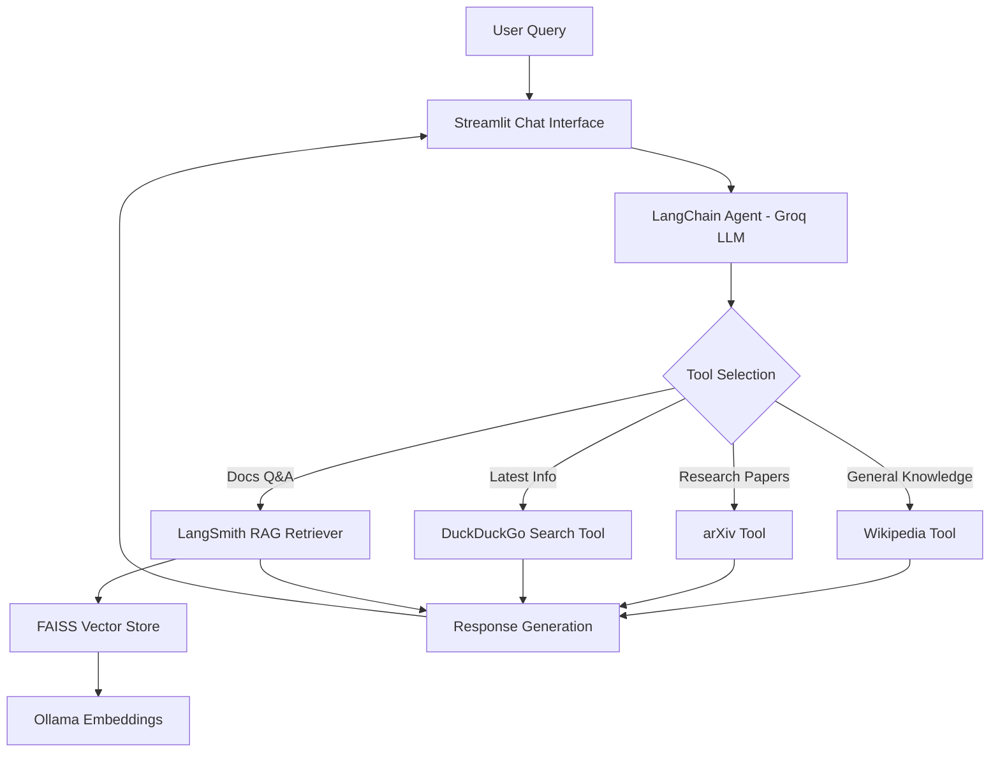
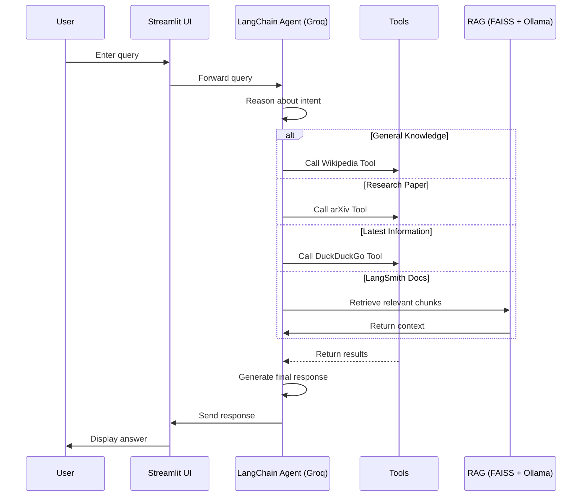

<div align="center">

# 🔍 AI-Search-Agent

### An Intelligent Agentic AI Search Assistant Powered by LangChain & Groq

*Automatically selects the right tool — Wikipedia, arXiv, DuckDuckGo, or RAG — to answer any query.*

[](https://www.python.org/)
[](https://www.langchain.com/)
[](https://groq.com/)
[](https://streamlit.io/)
[](https://github.com/facebookresearch/faiss)
[](#-license)

</div>

---

## 📖 Overview

**AI-Search-Agent** is an agentic AI application that intelligently decides *how* to answer a user's query instead of relying on a single static data source. Built with **LangChain Agents** and powered by **Groq LLM**, the agent reasons about each query and automatically routes it to the most relevant tool — whether that's Wikipedia for general knowledge, arXiv for research papers, DuckDuckGo for real-time information, or a custom **RAG pipeline** over LangSmith documentation.

The entire experience is wrapped in a clean, interactive **Streamlit** chat interface.

---

## 🏗️ Architecture



---

## ✨ Features

| Feature | Description |
|---|---|
| 🧠 **Intelligent Agentic Workflow** | Agent reasons over the query before deciding an action |
| 🔀 **Automatic Tool Selection** | No manual tool switching — the agent decides for you |
| 📚 **Wikipedia Search** | Answers general knowledge questions |
| 🔬 **arXiv Research Search** | Fetches relevant academic papers |
| 🌐 **DuckDuckGo Search** | Retrieves up-to-date, real-time information |
| 📄 **LangSmith Docs Retrieval (RAG)** | Answers questions from LangSmith documentation |
| 🗂️ **FAISS Vector Database** | Fast, efficient similarity search for retrieval |
| 🧬 **Ollama Embeddings** | Local embedding generation for document chunks |
| ⚡ **Groq LLM Integration** | High-speed inference for agent reasoning |
| 💬 **Streamlit Chat UI** | Simple, interactive, and responsive interface |
| 🧩 **Modular Tool Design** | Easy to extend with new tools |

---

## 🛠️ Tech Stack

<div align="center">

| Category | Technology |
|---|---|
| **Language** | Python |
| **Agent Framework** | LangChain |
| **LLM** | Groq |
| **UI** | Streamlit |
| **Vector Store** | FAISS |
| **Embeddings** | Ollama |
| **Search Tools** | Wikipedia API, arXiv API, DuckDuckGo Search |
| **Docs Source** | LangSmith Documentation |
| **Web Scraping** | BeautifulSoup, Requests |

</div>

---

## 📁 Project Structure

```
AI-Search-Agent/
├── app.py                  # Streamlit application entry point
├── tools/                  # Tool definitions (Wikipedia, arXiv, DuckDuckGo, RAG)
├── rag/                    # RAG pipeline: loaders, FAISS index, embeddings
├── requirements.txt        # Project dependencies
├── .env                    # Environment variables (not committed)
└── README.md
```

<details>
<summary>📂 Click to view an example detailed layout</summary>

```
AI-Search-Agent/
├── app.py
├── tools/
│   ├── wikipedia_tool.py
│   ├── arxiv_tool.py
│   ├── duckduckgo_tool.py
│   └── langsmith_rag_tool.py
├── rag/
│   ├── document_loader.py
│   ├── faiss_index.py
│   └── embeddings.py
├── requirements.txt
├── .env.example
└── README.md
```

</details>

---

## ⚙️ Installation

### 1️⃣ Clone the Repository

```bash
git clone https://github.com/<your-username>/AI-Search-Agent.git
cd AI-Search-Agent
```

### 2️⃣ Create a Virtual Environment

```bash
python -m venv venv

# Activate the environment
# Windows
venv\Scripts\activate
# macOS / Linux
source venv/bin/activate
```

### 3️⃣ Install Requirements

```bash
pip install -r requirements.txt
```

### 4️⃣ Set Environment Variables

Create a `.env` file in the project root:

```env
GROQ_API_KEY=your_groq_api_key_here
LANGCHAIN_API_KEY=your_langchain_api_key_here
```

### 5️⃣ Run the Streamlit App

```bash
streamlit run app.py
```

The app will be available at `http://localhost:8501` 🎉

---

## 🧠 How It Works

### 1. Agent Workflow

The core of AI-Search-Agent is a **LangChain Agent** powered by **Groq LLM**. When a user submits a query through the Streamlit chat interface, the agent:

1. Analyzes the intent and context of the query.
2. Decides which tool (or combination of tools) is best suited to answer it.
3. Invokes the selected tool(s) to retrieve relevant information.
4. Synthesizes the final response using the LLM.

### 2. Automatic Tool Selection

The agent is provided with a set of **modular tools**, each with a clear description of its purpose. Using **function-calling / ReAct-style reasoning**, the LLM evaluates the user's query against each tool's description and autonomously selects the most appropriate one — no hardcoded rules or manual switching required.

### 3. RAG Pipeline (LangSmith Documentation)

For questions specifically about LangSmith, the agent uses a **Retrieval-Augmented Generation (RAG)** pipeline:

1. LangSmith documentation is loaded and split into chunks.
2. Each chunk is embedded using **Ollama Embeddings**.
3. Embeddings are stored in a **FAISS** vector index.
4. On query, the most relevant chunks are retrieved and passed to the LLM as context.
5. The LLM generates a grounded, accurate answer based on retrieved context.

### 4. FAISS Vector Store

**FAISS (Facebook AI Similarity Search)** enables fast, efficient similarity search over the embedded document chunks, allowing the RAG pipeline to retrieve the most relevant context in milliseconds.

### 5. Ollama Embeddings

**Ollama** is used locally to generate high-quality vector embeddings for the LangSmith documentation, keeping the embedding step fast, private, and cost-free.

### 6. Groq LLM

**Groq** provides ultra-low-latency LLM inference, powering both the agent's reasoning/tool-selection logic and the final response generation.

### 7. LangChain Agent

**LangChain's Agent framework** ties everything together — orchestrating tool selection, execution, and response synthesis in a single coherent workflow.

---

## 🔄 Workflow Diagram



---

## 🚀 Future Improvements

- [ ] Add support for additional tools (e.g., YouTube, News API)
- [ ] Conversation memory across sessions
- [ ] Multi-agent collaboration for complex queries
- [ ] Deploy as a hosted web application
- [ ] Add response streaming in the UI

---

## 🤝 Contributing

Contributions are welcome! To contribute:

1. Fork the repository
2. Create a new branch (`git checkout -b feature/your-feature`)
3. Commit your changes (`git commit -m "Add your feature"`)
4. Push to the branch (`git push origin feature/your-feature`)
5. Open a Pull Request

---

## 📄 License

This project is licensed under the **MIT License**. See the [LICENSE](LICENSE) file for details.

---

## 👤 Author

**Prithvi Raj Mukhiya**
B.Tech in Electronics & Communication Engineering, IIIT Kota
Passionate about Machine Learning, Deep Learning, NLP, and building real-world GenAI applications.

---

## 🙏 Acknowledgements

- [LangChain](https://www.langchain.com/) — Agent framework
- [Groq](https://groq.com/) — LLM inference
- [Streamlit](https://streamlit.io/) — Application UI
- [FAISS](https://github.com/facebookresearch/faiss) — Vector similarity search
- [Ollama](https://ollama.com/) — Local embeddings
- [Wikipedia API](https://pypi.org/project/wikipedia/), [arXiv API](https://info.arxiv.org/help/api/index.html), [DuckDuckGo Search](https://pypi.org/project/duckduckgo-search/)

---

<div align="center">

**⭐ If you found this project useful, consider giving it a star!**

</div>
